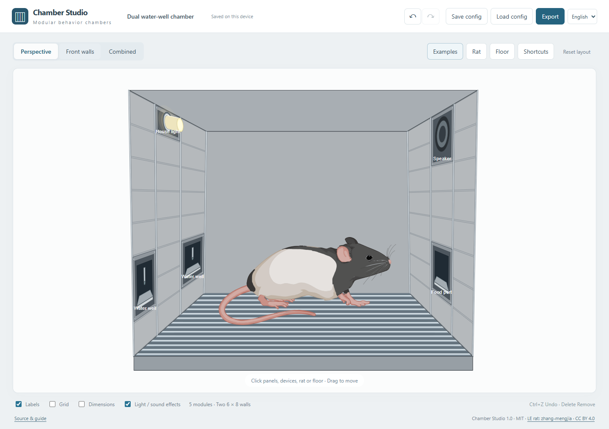

# Chamber Studio

**Draw modular behavioral chambers. Export figures you can still edit.**

[Open the editor](https://zhang-mengjia.github.io/chamber-studio/) · [中文说明](README.zh-CN.md) · [Report an issue](https://github.com/zhang-mengjia/chamber-studio/issues)

A free browser tool for arranging modules on two 6 × 8 unit walls and creating experiment schematics. Click directly on the perspective drawing or front walls, choose a module in the nearby popover, and drag to rearrange it. No account, build step or server backend is needed.

## Start drawing

1. [Open Chamber Studio](https://zhang-mengjia.github.io/chamber-studio/). Use **中文 / English** to change the interface language.
2. Click an empty panel to install a module. Each wall has three columns, each 2 units wide, with eight rows.
3. Click a device to change its state or parameters; drag it to another empty position. Click the floor or rat to edit them.
4. Choose **Export** to save PPT, PDF or PNG. Use **Save config** for a reusable `.chamber.json` file.

Try **Examples** for dual water wells, an operant chamber or an empty chamber. Loading an example is undoable.

## Modules and figures

| Module | Width × height | Options |
| --- | --- | --- |
| Food port | 2 × 2 | Empty / with food; grain, sucrose, chocolate, banana, strawberry |
| Water well | 2 × 2 | Empty / with water; 10, 20, 40, 80, 160 μL |
| Nose poke | 2 × 1 | Indicator off / on |
| Lever | 2 × 1 | Extended / retracted |
| House light | 2 × 1 | Off / steady / flashing, 0.2–5 Hz |
| Cue light | 2 × 1 | Off / on |
| Speaker | 2 × 2 | Silent / playing; Clicker, Siren, White noise, Pure tone |
| Camera | 2 × 1 | Off / recording |

Choose metal bars or perforated transparent acrylic for the floor. The original black-and-white Long–Evans rat keeps its original pose; move, scale, mirror or hide it. Perspective, front-wall and combined views share one vector drawing engine.

- **PowerPoint:** native editable vector shapes and text, grouped by component. Enter or ungroup a component to edit its parts. The rat retains 117 vector paths.
- **PDF:** vector paths and text on a 1280 × 760 point page.
- **PNG:** 1280 × 760, 2560 × 1520 or 3840 × 2280, optionally transparent.
- **Configuration:** portable JSON includes modules, parameters, rat, floor and view settings.

Exported diagram labels use English in both interface languages. A flashing lamp exports as a lit lamp with a frequency label. Front-wall views omit the rat and floor. Water levels, food colors, light halos and sound waves are schematic; this tool does not control hardware or play audio.

## Shortcuts

| Shortcut | Action |
| --- | --- |
| Ctrl / Command + Z | Undo |
| Ctrl / Command + Shift + Z, or Ctrl + Y | Redo |
| Delete / Backspace | Delete selected module or hide rat |
| Ctrl / Command + C, X, V | Copy, cut, paste a module |
| Arrow keys | Move module by a cell or rat by one drawing unit |
| Shift + arrow keys | Move rat by 10 units |
| Escape | Cancel drag or selection |
| Ctrl / Command + S | Save configuration |

Select a destination panel before pasting. Occupied positions are protected. Text inputs keep their native shortcuts. Undo retains up to 60 steps until the page is reloaded.

## Run offline

Download the repository ZIP from **Code → Download ZIP** or the [release page](https://github.com/zhang-mengjia/chamber-studio/releases), then extract it. Install [Node.js](https://nodejs.org/) **22 or later** once.

- **Windows:** double-click `start.cmd` (or `启动网页.cmd`). Use `停止服务.ps1` to stop the background server.
- **Windows, macOS or Linux:** open a terminal in the extracted folder and run `npm start`, then visit **http://127.0.0.1:47831/**. Stop a terminal-started server with Ctrl+C.

No `npm install` is needed. All rendering and export libraries are bundled; local use works without internet. Do not open `index.html` directly with `file://` because module and template loading requires HTTP.

Use a current Chrome, Edge, Firefox or Safari. The editor uses JavaScript modules, JSON module imports and modern browser APIs. A desktop browser is recommended for precise placement; the controls also adapt to narrow screens.

## Your data

Editing and exporting happen in your browser. There are no analytics, accounts or application upload endpoints. The current configuration and language preference are saved in this browser's local storage; clearing site data removes them. Download configuration files to keep backups or move work between computers. The online and localhost versions have separate browser storage. GitHub serves the online site's static files.

## Development and contributions

Run `npm test`. There is no build step. Static files live in `public/`; `server.mjs` serves them on localhost. CI tests changes and deploys `public/` to GitHub Pages after successful checks on `main`. See [CONTRIBUTING.md](CONTRIBUTING.md) for the project map and validation guidance.

## License and artwork credit

Code and documentation: **MIT**, copyright 2026 [zhang-mengjia](https://github.com/zhang-mengjia).

Original LE rat artwork: **[CC BY 4.0](https://creativecommons.org/licenses/by/4.0/)**, credit **zhang-mengjia**. When sharing figures that include the rat, retain its credit, source and license link in the caption or accompanying material, and indicate modifications. See [artwork attribution](public/assets/ATTRIBUTION.md) and [third-party notices](THIRD_PARTY_NOTICES.md). The rat's separate license also applies to its appearance in screenshots and exports.
